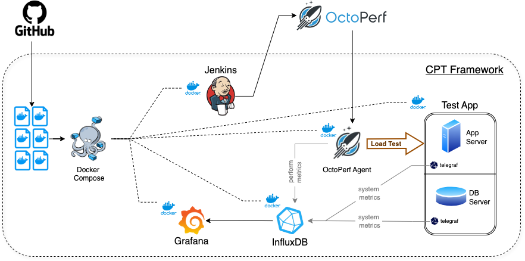
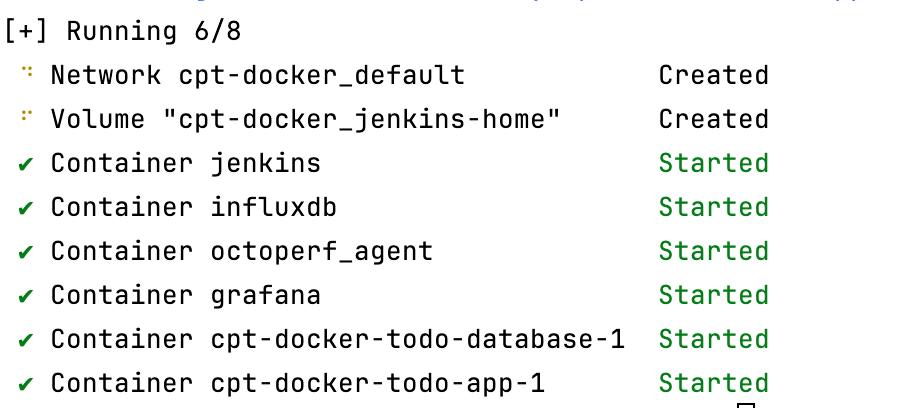
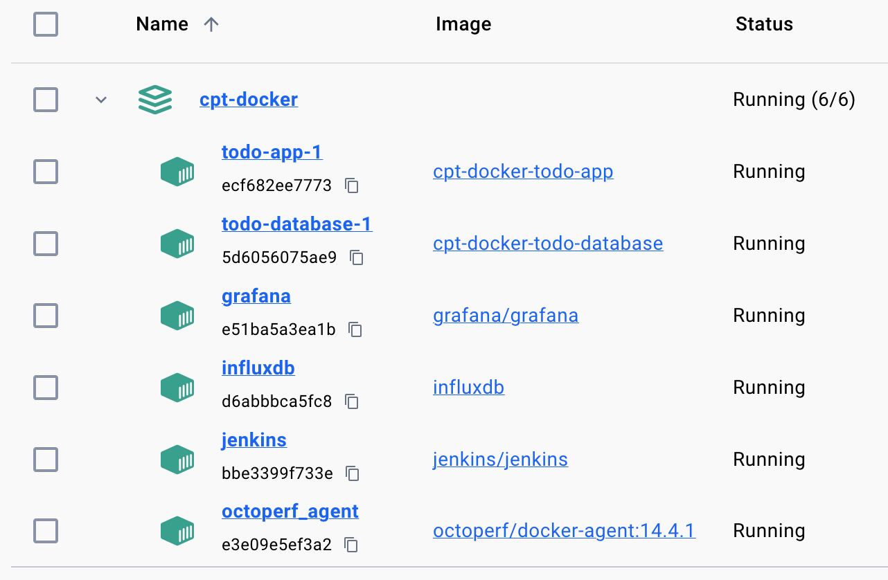

# CPT - Continuous Performance Testing Framework MVP
## <ins>[CPT Framework Presentation (PDF)](CPT%20-%20Demo%20-%20uv.pdf)
##  <ins>[Architecture](https://drive.google.com/file/d/1E9mTDnDnQkk8gp-2cj_j2VHO6x6mOM84/view?usp=sharing):

### <ins>Deployment steps:</ins>
 __Prerequesites:__ 
 __a. OS: Linux/Mac with Shell support__ 
 __b. Architecture: Intel-based__ 
 __c. TODO: check supprt of AppleSilicon-based Mac and Widows OS__ 

 __1. Install Docker Engine__ 
 __2. Install Docker-Compose__ 
 __3. Checkout sources of CPT__ 
 __4. From the root of the project run `./deploy.sh`__ or  `docker-compose build --no-cache` `docker-compose up -d` 
  <ins>NOTE:</ins> to build just one container use `docker build . --no-cache -t jenkins`

 __5. Wait until deployment is finished (around 60 sec) and all the containers up and running__

CPT services after deployment:

 System        | URL                    | Details        
---------------|------------------------|---------------- 
| Jenkins       | http://localhost:8080/ | admin/admin    |
| ToDo test App | http://localhost:3000/ |                |
| Grafana       | http://localhost:4000/ | admin/password |
| Influx DB     | http://localhost:8086/ | admin/admin    |
----
## Next steps:
### [CPT - CI/CD integration](README_CI.md)   [CPT - Grafana Dasboards](README_DASHBOARDS.md)