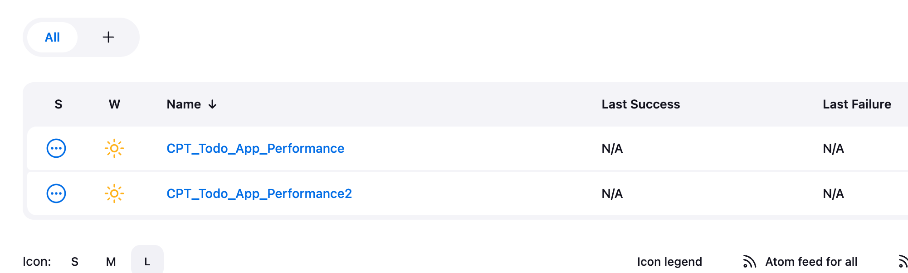
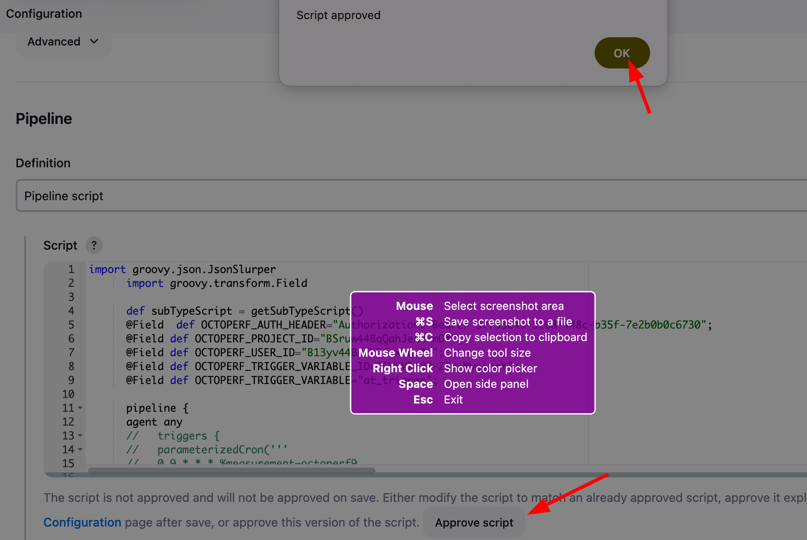
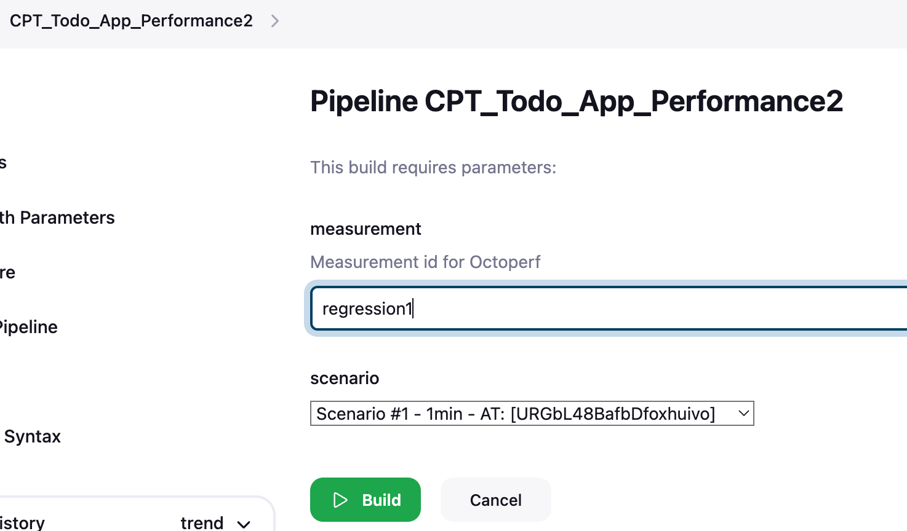
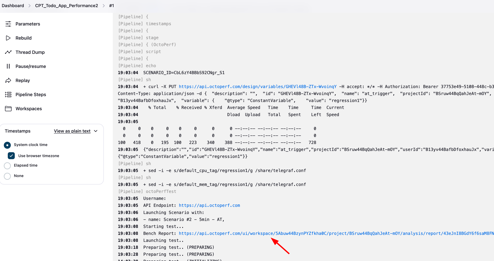
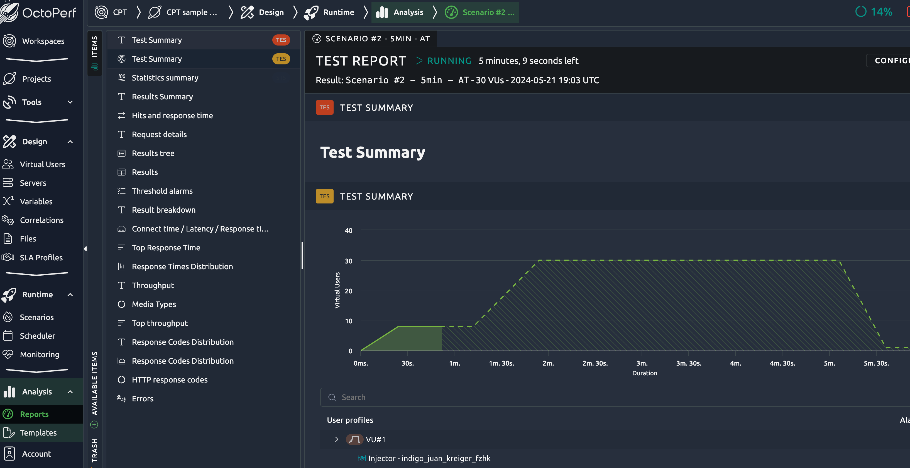
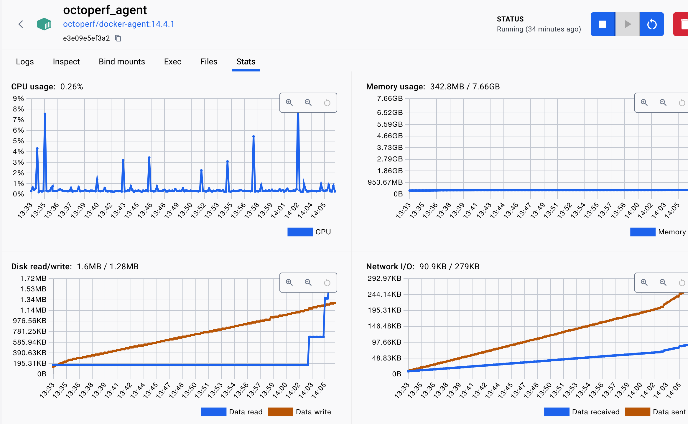
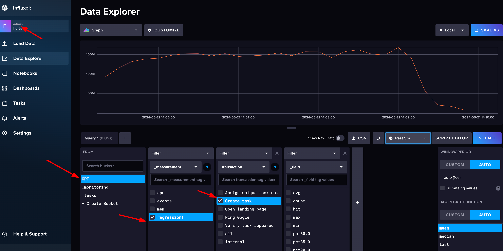
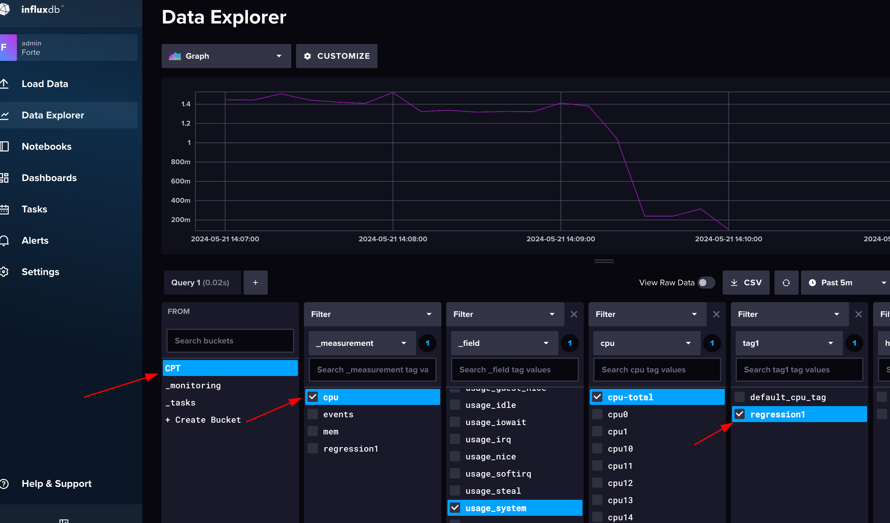
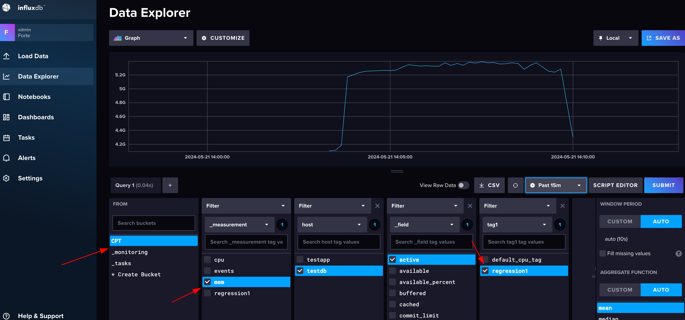

# CPT - CI/CD integration
Jenkins CI is embedded into framework as separate Docker image and has preconfigured Octoperf and Test App integration.

#### 1. Login into Jenkins http://localhost:8080/login as <ins>admin\admin

#### 2. Open CPT_Todo_App_Performance2 job configuration page
http://localhost:8080/job/CPT_Todo_App_Performance2/configure 
Approve pipeline scripts

#### 3. Click <ins>Build with Parameters</ins> for <ins>CPT_Todo_App_Performance2</ins>  
Jenkins job loads the tests list in __scenario__ dropdown for CPT automation in hardcoded [Octoperf project](https://api.octoperf.com/ui/workspace/5Abuw44BzynPYZfkha0C/project/BSruw44BqQahJeAt-mOY/runtime/scenario) (see line 61 [CPT_Todo_App_Performance2.xml](jenkins/jobs/CPT_Todo_App_Performance2.xml)). __Measurement__ parameter is used as unique symbolic name/tag to distinguish one performance test run from another while building dashboards.

#### 4. Trigger build  
- Wait until it is finished (see link to Octoperf run in Console)

#### 5. Open InfluxDB http://localhost:8086 and verify that reported metrics under Forte org and CPT bucket are coming with appropriate measurement/tag name

Currently only CPU ant RAM are tracked as system metrics on SUT. But that could be customized/extended via [telegraf.conf](share/telegraf.conf) by enabling plugins and customizing tags

#### 6. Repeat steps 4-5 for few more performance tests