# CPT - Grafana Dasboards
Grafana Dashboard goes together with CPT as dockerized environment with few preconfigured dashboard for performance tests analysis
### <ins> Aggregated dashboard</ins> 
__1. Login into Grafana http://localhost:4000/login as <ins>admin\password__  
__2. Go to Dashboard>Performance Testing Dashboards>CPT-Aggregated report__  
__3. Zoom in dashboard to see interested measurement in full width__
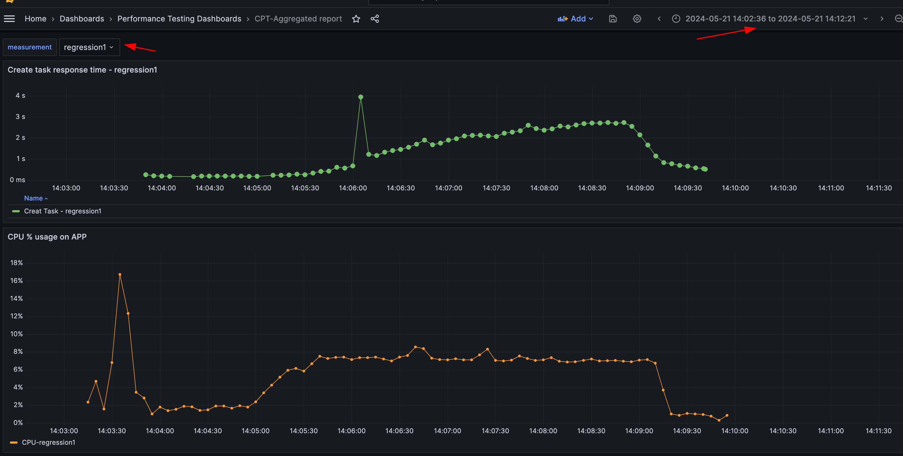
__4. Scroll down through the dashboard and review all the metrics recorded for target measurement__  
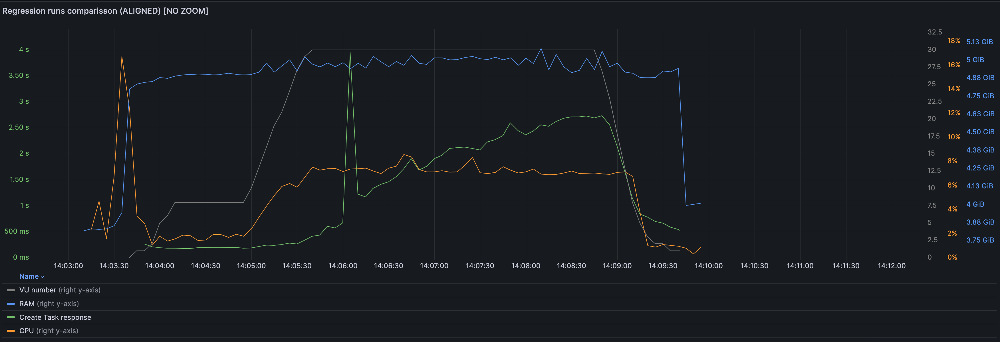
__5. Repeat steps 3-4 for other recorded measurements__
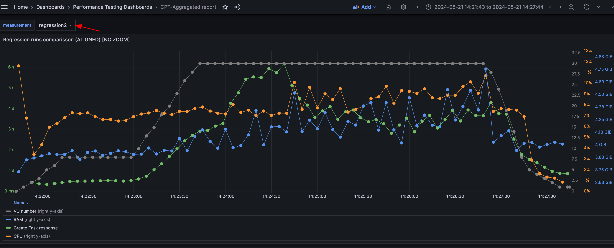
<ins>NOTE:</ins> to update list of metrics displayed on dashboard click "Edit" menu and disable not needed series
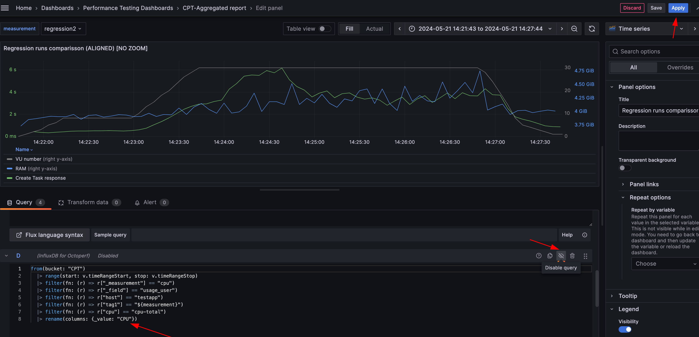
<ins>NOTE2:</ins> User can just temporary apply changes to the pre-configured dashboards as they were deployed via provisioning mechanism. If changes must be saved forever  - copy JSON configuration to clipboard and create a new dashboard based on the config 
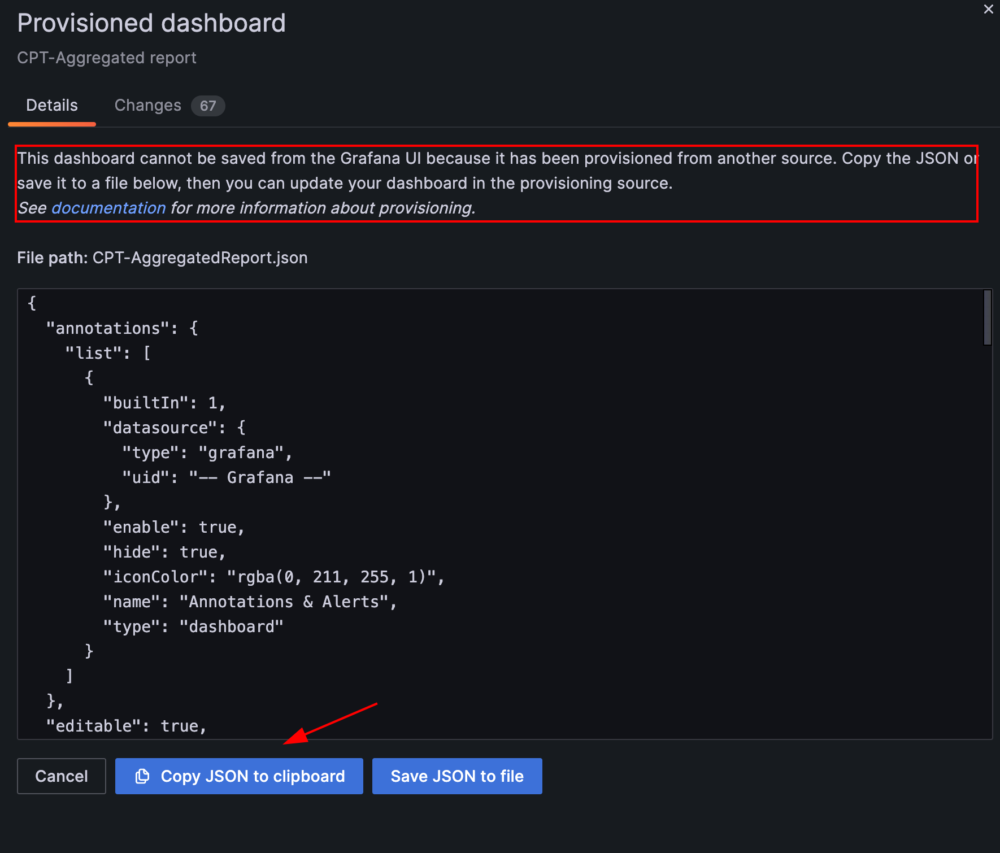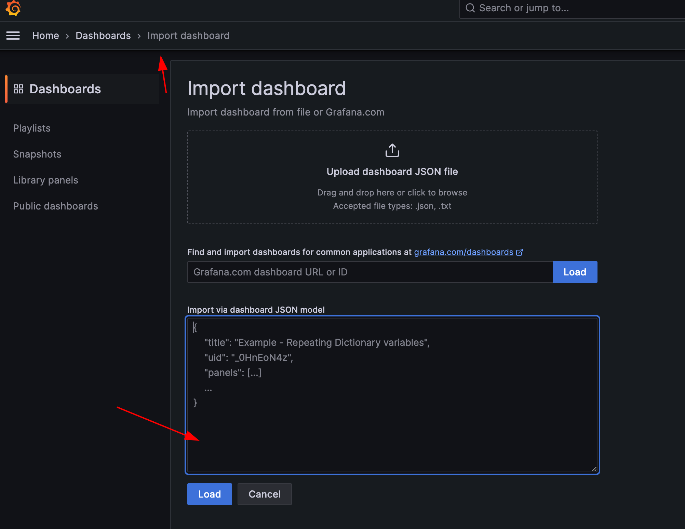
<ins>NOTE3:</ins> Currently list of measurements is hardcoded as static list of values under Variables section. If required the list of values could be dynamically loaded or extended with required values
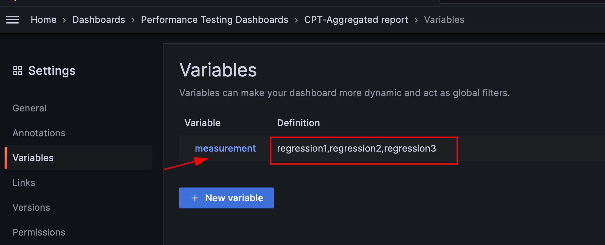
----
### <ins> Comparison dashboard</ins> 

__Go to Dashboard>Performance Testing Dashboards>CPT-Comparisson dashboard__  
There is no out-of box Grafana-based dashboard to compare timeshifted performance tests metrics
https://community.grafana.com/t/visualize-time-shifted-data/80285
Thus, feature is implemented via exporting time-shifted performance metrics into csv  and import via Grafana Infinity plugin.

 1. On Dashboard pick the range that will include both interested measurements (for ex regression1 and regression2)
 2. On panel "Regression runs comparisson (ALIGNED) [NO ZOOM]" click "Inspect" menu
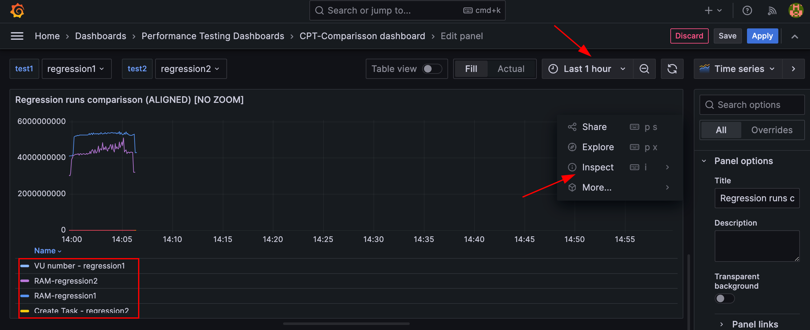
 3. Export tabular data aggregated by timestamp as csv file
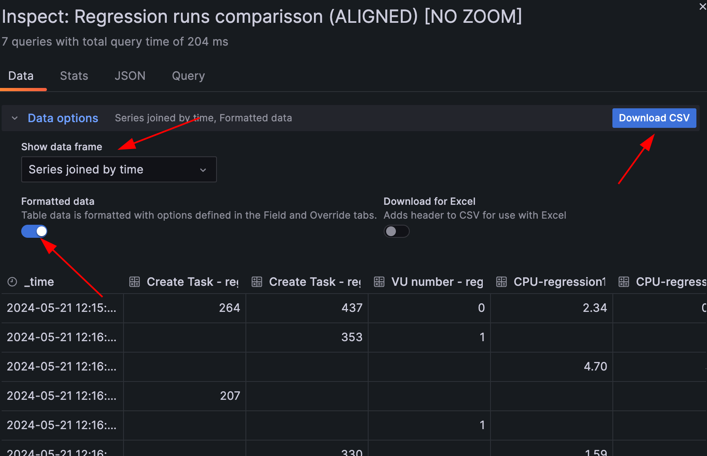
 4. On panel "Regression comparisson" click "Edit" menu. And upload just generated csv file 
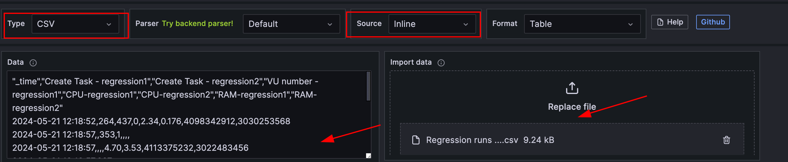
5. Click Apply and Save.
6. On updated "Regression comparisson" panel click "Zoom to data". Aggregated results for selected measurements are loaded
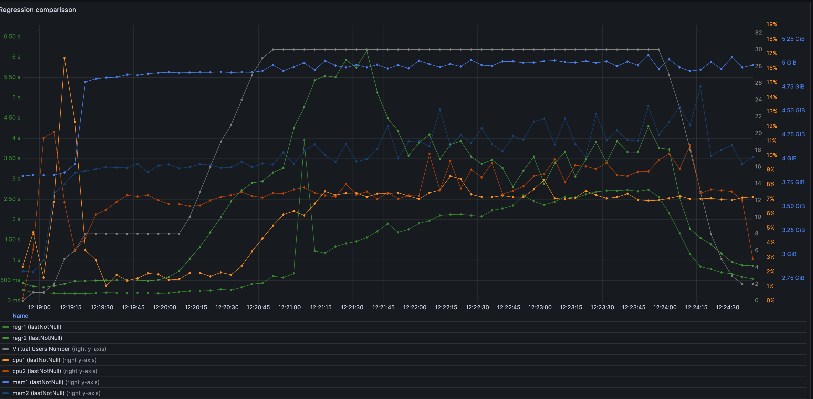
7. To pick different measurements for comparisson - use dropdowns on the top
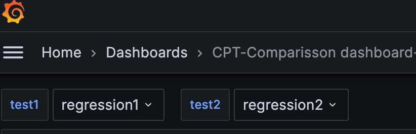
<ins>NOTE:</ins> Currently list of measurements is hardcoded as static list of values under Variables section. If required the list of values could be dynamically loaded or extended with required values
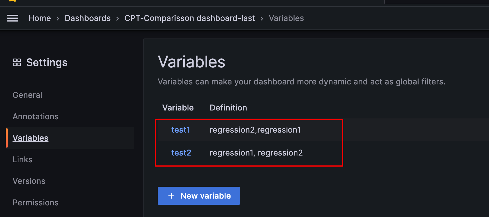